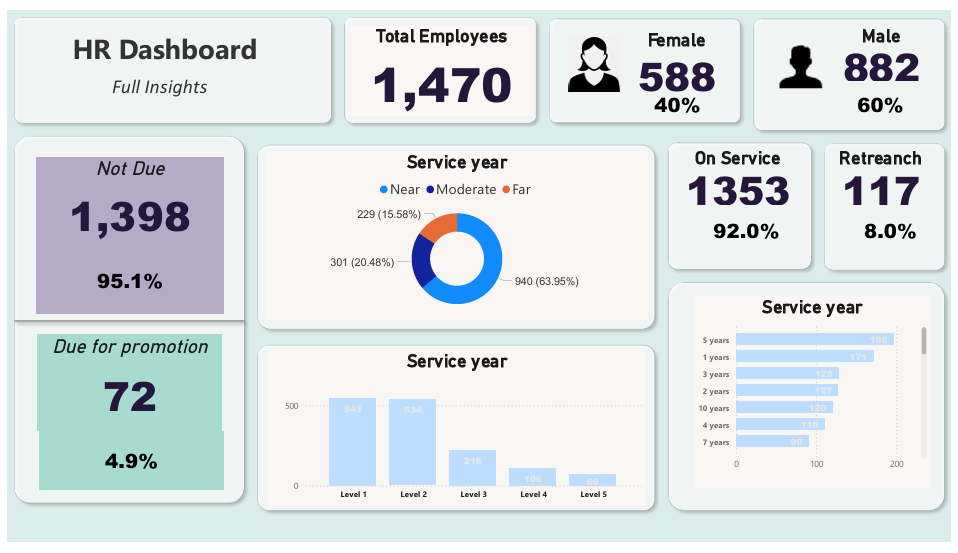

# 👥 HR Analytics – Power BI

## *Project Objective*
This project studies employee structure and attrition.  
The aim is to understand which departments or age groups face more attrition and how experience affects employee decisions.

---

## *Process*
- Loaded employee data  
- Cleaned missing values  
- Created KPIs for total employees and attrition rate  
- Built visuals for age, gender, education, job roles, and experience  
- Added filters for easy analysis  

---

## *Questions Answered*
- What is the total number of employees?  
- What is the attrition rate?  
- Which department has the highest attrition?  
- Which age group leaves the company most?  
- What is the gender distribution?  
- How does experience influence attrition?  
- Which education fields and job roles are most common?  

---

## *Dashboard*
- 
[Download Dashboard PDF](hr-analytics-dashboard.pdf)
[Download PBIX File](hr-analytics-dashboard.pbix)

---

## *Conclusion*
The dashboard gives a clear view of employee trends and attrition patterns.  
It shows which groups need more HR attention and helps in improving retention and workforce planning.

---

## *Future Implementation*
- Add prediction model for attrition  
- Add drill-down pages for deeper role-level analysis
